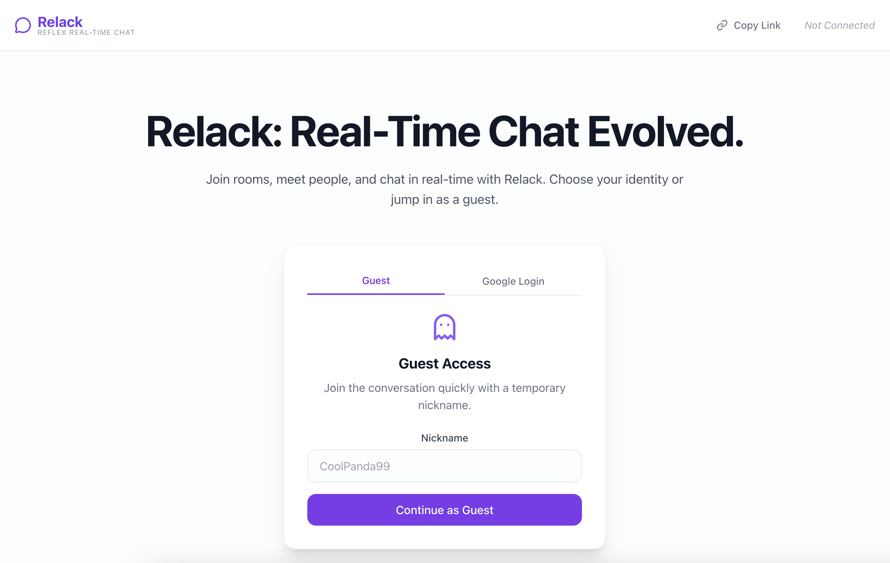
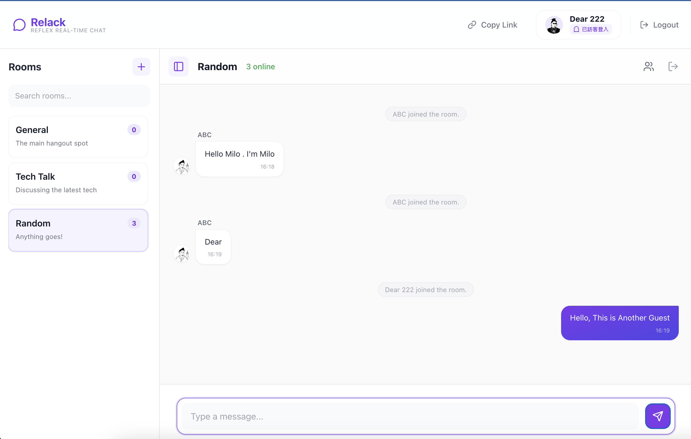

# Relack

**Relack** is a secure, self-hosted team communication platform built with [Reflex](https://reflex.dev/) and Python. It is designed to be a privacy-focused alternative to SaaS solutions like Slack.

## Motivation

As SaaS services like Slack continue to expand globally, they have become the standard for enterprise communication. However, this convenience comes with a cost: data sovereignty and confidentiality.

Many enterprises are increasingly concerned that storing sensitive internal communications and trade secrets on third-party servers—often located in different jurisdictions—exposes them to risks. These risks include potential access by foreign governments, data breaches, or unauthorized surveillance.

**Relack** was created to solve this problem. By providing a solution that can be fully self-hosted and controlled within your own infrastructure, Relack ensures that your organization's critical information remains private and secure, without sacrificing the modern chat experience.

## Features

- **Full Data Control**: You own your data. No third-party SaaS lock-in.
- **Pure Python**: Built entirely in Python using the Reflex framework, making it easy to customize and extend.
- **Modern UI**: Clean and responsive interface for seamless team collaboration.

## Screenshots

### Authentication
Relack supports anonymous guest access for quick and easy collaboration.



### Main Interface
A full-featured chat interface with room management and real-time messaging.



## Getting Started

This project is managed with [Poetry](https://python-poetry.org/).

### Prerequisites

- Python 3.11.x
- Poetry

### Installation

1. Clone the repository:
   ```bash
   git clone https://github.com/your-username/relack.git
   cd relack
   ```

2. Install dependencies:
   ```bash
   poetry install
   ```

### Environment variables (.env)

Copy the template and fill in the values before running the app:

```bash
cp .env.template .env
```

Set these in `.env`:

- `GOOGLE_CLIENT_ID` / `GOOGLE_CLIENT_SECRET`
   1) In Google Cloud Console, create OAuth 2.0 credentials → Web application.
   2) Authorized JavaScript origins: add `http://localhost:3000` (plus your deploy domain later).
   3) Authorized redirect URIs: add `http://localhost:3000/auth/google/callback` (plus your deploy domain later).
   4) Paste the client ID/secret into `.env`. Wrong or missing values will raise "Invalid audience" during Google login. Reference: https://github.com/masenf/reflex-google-auth
- `ADMIN_PASSCODE`: Any secret string you define. It unlocks the in-app admin dashboard (via the "Administrator Settings" link). Keep it private and change it for your environment.

### Running the App

Start the development server (via Poetry env):

```bash
poetry run reflex run
```

The application will be available at `http://localhost:3000`.

### Python version help (common first-run issue)

If you see an error like `Current Python version (3.x) is not allowed by the project (>=3.11,<3.12)`, point Poetry at a 3.11 interpreter and retry:

macOS (Homebrew Python 3.11):

```bash
brew install python@3.11
poetry env use /opt/homebrew/bin/python3.11
poetry install
```

If you already have `python3.11` on your PATH (e.g., from Xcode CLT or an existing install), you can simply run:

```bash
poetry env use python3.11
poetry install
```

After switching, rerun the server:

```bash
poetry run reflex run
```
