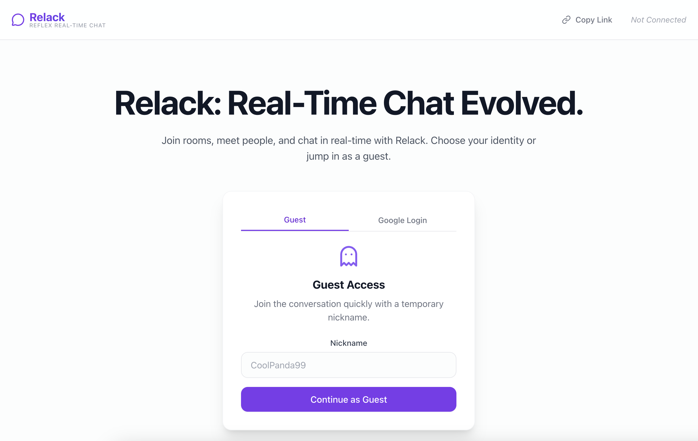
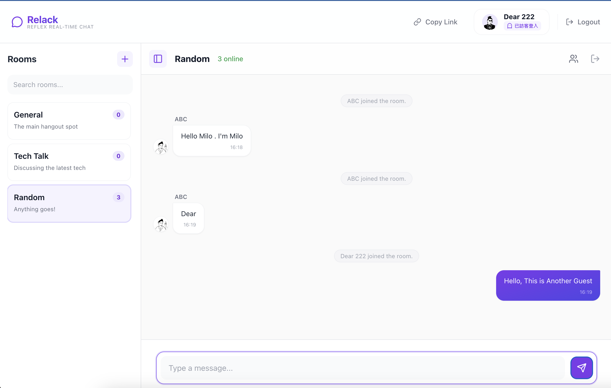

# Relack

**Relack** is a secure, self-hosted team communication platform built with [Reflex](https://reflex.dev/) and Python. It is designed to be a privacy-focused alternative to SaaS solutions like Slack.

## Motivation

As SaaS services like Slack continue to expand globally, they have become the standard for enterprise communication. However, this convenience comes with a cost: data sovereignty and confidentiality.

Many enterprises are increasingly concerned that storing sensitive internal communications and trade secrets on third-party servers—often located in different jurisdictions—exposes them to risks. These risks include potential access by foreign governments, data breaches, or unauthorized surveillance.

**Relack** was created to solve this problem. By providing a solution that can be fully self-hosted and controlled within your own infrastructure, Relack ensures that your organization's critical information remains private and secure, without sacrificing the modern chat experience.

## Architecture & Design

Interested in how Relack is built? Check out our [Project Design and Architecture Overview](docs/Relack%20Project%20Design%20and%20Architecture%20Overview.pdf).

## Features

- **Full Data Control**: You own your data. No third-party SaaS lock-in.
- **Pure Python**: Built entirely in Python using the Reflex framework, making it easy to customize and extend.
- **Modern UI**: Clean and responsive interface for seamless team collaboration.
- **Calls**: Start an audio call in any room or direct message; see [Calls](#calls).

## Screenshots

### Authentication
Relack supports anonymous guest access for quick and easy collaboration.



### Main Interface
A full-featured chat interface with room management and real-time messaging.



## Calls

Every room (public, private, or direct message) has a call button in its header. The call itself runs in a separate call app, opened in a dialog through the DDNS Intent `call.join`. relack doesn't name the call app: it uses whichever installed app provides `call.join`, as reported by the re-ddns intent registry (for example the self-hosted [LiveKit audio chat](https://github.com/milochen0418/reflex_ddns_livekit_audio_chat) at `livekit.reflex-ddns.com`). If several apps provide it, the dialog asks which one to use.

- **Who gets rung**: everyone who can see the room for private rooms and direct messages, and the people who have it open for public rooms. A popup offers Accept / Decline for about 45 seconds. After that, a room in a call shows a green badge in the sidebar and a **Join call** button in its header.
- **Keeps running**: other dialogs (People → Pick member, profiles…), the **–** button, a click outside the call or Escape minimize the call to a tray at the bottom left; you keep talking while you use relack, including on other pages such as profiles. Click the tray (or **Join call**) to bring it back.
- **Leaving**: hanging up, the call's **×** (in the dialog or the tray), or starting another call takes you out of the call. The call ends when its last person leaves.
- **Privacy**: each call gets a random id, so the call of a private room can't be guessed from its name. The id is passed to the call app privately (by postMessage), so it never appears in the dialog's URL.

Settings (all optional):

- `DDNS_INTENT_PROVIDER_CALL_JOIN`: the app(s) that handle `call.join` when there is no registry, e.g. `livekit` for local development. Any app implementing the intent works; see the [contract](https://github.com/milochen0418/reflex_ddns_livekit_audio_chat#-calls-from-other-apps-ddns-intent-calljoin).
- `DDNS_INTENT_URL_LIVEKIT`: where that app runs, for local development (e.g. `http://localhost:3200`).
- `RELACK_CALL_APP`: always use this app, skipping the registry.

E2E suite (the call app must be running at `DDNS_INTENT_URL_LIVEKIT`, on media ports that are free locally):

```bash
DDNS_INTENT_PROVIDER_CALL_JOIN=livekit DDNS_INTENT_URL_LIVEKIT=http://localhost:3200 \
DDNS_INTENT_URL_RELACK=http://localhost:3000 poetry run ./run_test_suite.sh call_intent
```

## Getting Started

This project is managed with [Poetry](https://python-poetry.org/).

### Prerequisites

- Python 3.11.x
- Poetry

### Installation

1. Clone the repository:
   ```bash
   git clone https://github.com/your-username/relack.git
   cd relack
   ```

2. Install dependencies:
   ```bash
   poetry install
   ```

### Environment variables (.env)

Copy the template and fill in the values before running the app:

```bash
cp .env.template .env
```

Set these in `.env`:

- `GOOGLE_CLIENT_ID` / `GOOGLE_CLIENT_SECRET`
   1) In Google Cloud Console, create OAuth 2.0 credentials → Web application.
   2) Authorized JavaScript origins: add `http://localhost:3000` (plus your deploy domain later).
   3) Authorized redirect URIs: add `http://localhost:3000/auth/google/callback` (plus your deploy domain later).
   4) Paste the client ID/secret into `.env`. Wrong or missing values will raise "Invalid audience" during Google login. Reference: https://github.com/masenf/reflex-google-auth
- `ADMIN_PASSCODE`: Any secret string you define. It unlocks the in-app admin dashboard (via the "Administrator Settings" link). Keep it private and change it for your environment.

### Running the App

Start the development server (via Poetry env):

```bash
poetry run reflex run
```

The application will be available at `http://localhost:3000`.

For quick restarts during development (kills anything on ports 3000/8000, then restarts Reflex):

```bash
poetry run ./reflex_rerun.sh
```

### Python version help (common first-run issue)

If you see an error like `Current Python version (3.x) is not allowed by the project (>=3.11,<3.12)`, point Poetry at a 3.11 interpreter and retry:

macOS (Homebrew Python 3.11):

```bash
brew install python@3.11
poetry env use /opt/homebrew/bin/python3.11
poetry install
```

If you already have `python3.11` on your PATH (e.g., from Xcode CLT or an existing install), you can simply run:

```bash
poetry env use python3.11
poetry install
```

After switching, rerun the server:

```bash
poetry run reflex run
```
